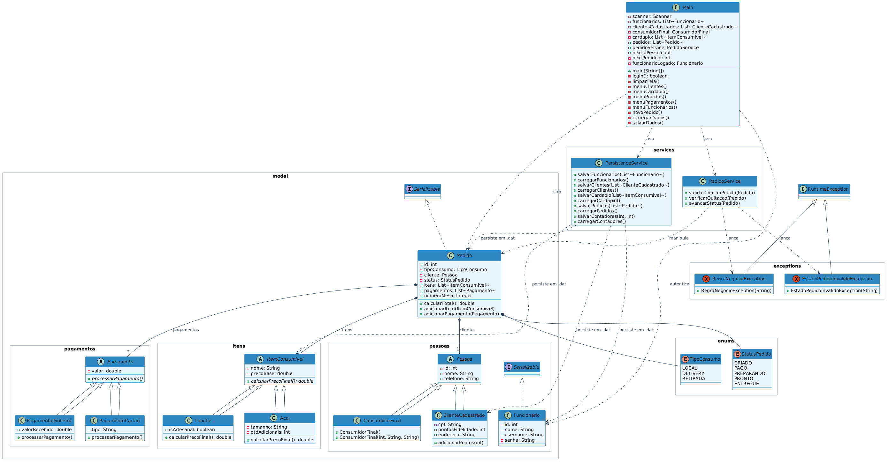

# Lanchonete Manager

Sistema de gerenciamento para lanchonetes desenvolvido em Java com terminal interativo.
Permite controle de pedidos, cardápio, clientes, funcionários e pagamentos com
persistência em arquivos e máquina de estados para o ciclo de vida dos pedidos.

## Disciplina

Programação Orientada a Objetos

**Professor:** Jefferson Gomes Dutra

## Componentes do Grupo

- ANTONIONNE COELHO PAULINO - 20250041045
- GERALDO LUCAS BEZERRA ROCHA - 20200047480
- FRANCISCO EDSON DA COSTA FILHO - 20240020730
- LAZARO GABRIEL EWERTON DA SILVA SANTOS - 20240028184

## Funcionalidades

- **Autenticação** — Login com usuário e senha (3 tentativas)
- **Clientes** — Cadastro de clientes com CPF (com pontos de fidelidade) e consumidor final (sem cadastro)
- **Cardápio** — Cadastro de Lanches (artesanal com markup de 20%) e Açai (com adicionais a R$ 2,50 cada)
- **Pedidos** — Criação com tipo de consumo (Local, Delivery, Retirada), seleção de cliente, adição/remoção de itens e número da mesa
- **Máquina de estados** — Pedido passa por: CRIADO → PAGO → PREPARANDO → PRONTO → ENTREGUE (com validações de transição)
- **Pagamentos** — Dinheiro (com cálculo de troco) e Cartão (crédito/débito)
- **Funcionários** — Cadastro com username único e listagem
- **Persistência** — Dados salvos em arquivos via serialização Java (carga ao iniciar, salvamento automático ao encerrar)

## Conceitos de POO aplicados

| Conceito | Onde foi aplicado |
|----------|-------------------|
| **Encapsulamento** | Todos os atributos são `private` com getters/setters públicos |
| **Herança** | `Pessoa` → `ClienteCadastrado`, `ConsumidorFinal`; `Funcionario` → `Pessoa`; `ItemConsumivel` → `Lanche`, `Acai`; `Pagamento` → `PagamentoDinheiro`, `PagamentoCartao` |
| **Polimorfismo** | `ItemConsumivel.calcularPrecoFinal()` (Lanche e Acai com regras diferentes); `Pagamento.processarPagamento()` (Dinheiro e Cartao com comportamentos distintos) |
| **Classes abstratas** | `Pessoa`, `ItemConsumivel`, `Pagamento` |
| **Estado dinâmico** | `StatusPedido` com máquina de estados validada em `PedidoService` |
| **Tratamento de exceções** | `RegraNegocioException` e `EstadoPedidoInvalidoException` (exceções personalizadas) |
| **Persistência** | Serialização Java (`ObjectOutputStream`/`ObjectInputStream`) para arquivos `.dat` |

## Estrutura do Projeto

```
src/
├── Main.java                         # Classe principal com interface terminal
├── enums/
│   ├── StatusPedido.java             # CRIADO, PAGO, PREPARANDO, PRONTO, ENTREGUE
│   └── TipoConsumo.java              # LOCAL, DELIVERY, RETIRADA
├── exceptions/
│   ├── EstadoPedidoInvalidoException.java
│   └── RegraNegocioException.java
├── model/
│   ├── Pedido.java
│   ├── itens/
│   │   ├── Acai.java
│   │   ├── ItemConsumivel.java       # (abstrata)
│   │   └── Lanche.java
│   ├── pagamentos/
│   │   ├── Pagamento.java            # (abstrata)
│   │   ├── PagamentoCartao.java
│   │   └── PagamentoDinheiro.java
│   └── pessoas/
│       ├── ClienteCadastrado.java
│       ├── ConsumidorFinal.java
│       ├── Funcionario.java
│       └── Pessoa.java               # (abstrata)
└── services/
    ├── PedidoService.java            # Regras de negócio e máquina de estados
    └── PersistenceService.java       # Persistência em arquivos

dados/                                 # Diretório gerado em execução
├── cardapio.dat
├── clientes.dat
├── contadores.dat
├── funcionarios.dat
└── pedidos.dat
```

## Diagrama de Classes

O diagrama UML está disponível em:
- `DIAGRAMA.png` — imagem renderizada


## Regras de Negócio

1. Pedidos Delivery/Retirada exigem cliente cadastrado com CPF
2. Pedido só é quitado quando total pago >= total devido
3. Pagamento em dinheiro exige valor recebido >= valor devido
4. Status segue ordem sequencial: PAGO → PREPARANDO → PRONTO → ENTREGUE
5. Pedido não pago (CRIADO) não pode avançar para preparo
6. Pedido entregue (ENTREGUE) não pode mais ser alterado
7. Username de funcionário deve ser único no sistema

## Como executar

### Pré-requisitos

- Java 17+ instalado

### Compilar

```bash
javac -d out src/Main.java src/enums/*.java src/exceptions/*.java src/model/*.java src/model/itens/*.java src/model/pagamentos/*.java src/model/pessoas/*.java src/services/*.java
```

### Executar

```bash
java -cp out Main
```

### Login padrão

- **Usuário:** admin
- **Senha:** admin123

### Limpar dados salvos (opcional)

Para reiniciar os dados do sistema, apague a pasta `dados/`:

```bash
rm -rf dados/
```
